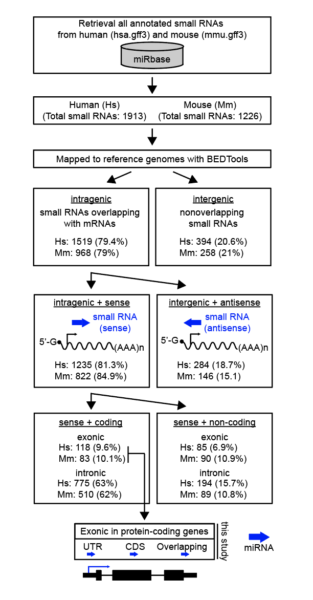
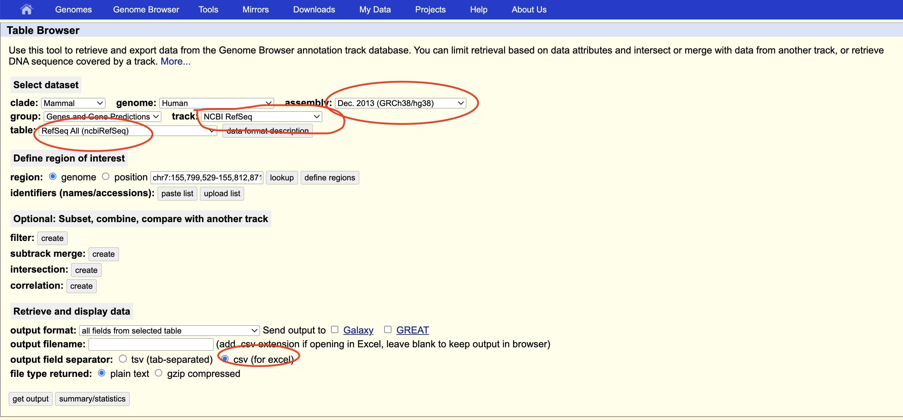
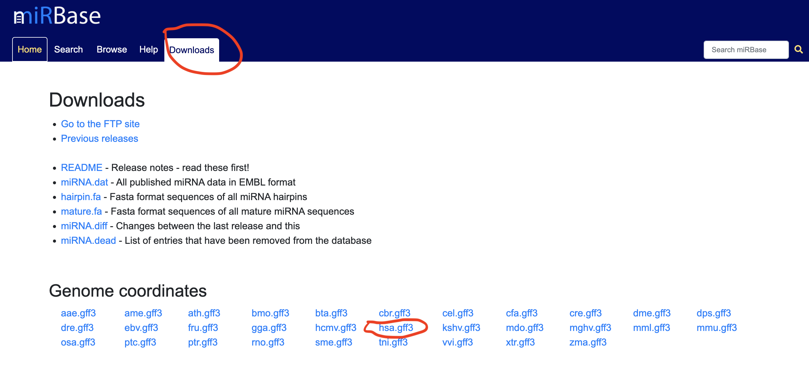

##               Mining exonic miRNAs from human and mouse genome

This script is written by Tyron Chang.The goal is to leverage bioinformatic tools to mine exonic miRNAs and understand the processing of these specific miRNAs and their relationships with their host genes.

The programming languages and tools used for this study are are shown below:
1. Python (data cleaning and processing)
2. BEDTools (overlapping the exonic microRNAs)
3. Shell (use awk and basic command lines to convert tsv files into bed file)

### The pipeline is shown below:

### Source of the data:

miR loci data are retrieved from [miRBase](https://www.mirbase.org/download/)

The original NCBI RefSeq data are retrieved from [UCSC genome table browser](https://genome.ucsc.edu/cgi-bin/hgTables)

Please see the instruction below to see how to download the data.

*Original master table*:

*miRBase data*:

There is a lot of files so if you just want to see the final output please just go to the excel file folder named MS_tables. 

-----------------------------------------------------------------------------------------------

### More information about the following files:
Mapping of the coordinates of miRNAs was done with Bedtools with additional shell scripts. Data cleaning is done with python file. Here I use OOP to import a series of classes and methods. Subsequent characterization of exon-derived miRNAs (e.g. Pie charts) was carried out with the metadata generated from this pipeline

**Python files in utils folder**:

*  **`Data.ipynb`** ->this file is used for data cleaning, and it contains a series of methods in a class.

* **`Gene_func.ipynb`**-> this file will assign new column to the dataframe to indicate if the host gene is a protein coding or non-coding gene.

* **`EXONIC.ipynb`**-> this file contains modules that allow you to assign regions for exonic miRNA locations (e.g. 3'UTR, 5'UTR, CDS).

**Shell scripts**:

Execute these scripts in order please!
1. map all exonic miRs=> **`bedtools_human_exonic_miR.sh`**
2. map all intronic and no host gene miRs=> **`bedtools_human_nonexonic_miR.sh`**
3. map all intronic miRs=> **`bedtools_human_intronic_miR.sh`**
4. move all csv files into a new csv folder=> **`human_csv.sh`**

Execute these scripts in order please!
1. map all exonic miRs=> **`bedtools_mouse_exonic_miR.sh`**
2. map all intronic and no host gene miRs=> **`bedtools_mouse_nonexonic_miR.sh`**
3. map all intronic miRs=> **`bedtools_mouse_intronic_miR.sh`**
4. move all csv files into a new csv folder=> **`mouse_csv.sh`**

**gff3 files**:

*Human*
all human miRs with their genetic coordinates=> **`hsa.gff3`**

*Mouse*
all mouse miRs with their genetic coordinates=> **`mmu.gff3`**

**Bed files**:

*Human*
1. all exonic miRs=> **`human_exonic_miR_NCBI.bed`**
2. all intronic and no host genes miRs=> **`human_nonexonicmiR_NCBI.bed`**
3. all intronic miRs=> **`human_intronic_miR_NCBI.bed`**
4. all no host genes miRs=> **`human_miR_no_hostmRNA_NCBI.bed`**

**tsv files**:

Any files that contain **` _unique`** means the isoforms of host genes of miRNAs are dropped

*Human*
1. all exonic miRs=> **`human_exonic_miR_NCBI.tsv`**
2. all intronic and no host genes miRs=> **`human_nonexonicmiR_NCBI.tsv`**
3. all intronic miRs=> **`human_intronic_miR_NCBI.tsv`**
4. all no host genes miRs=> **`human_miR_no_hostmRNA_NCBI.tsv`**

